# Oprec_2025_Pertemuan_2

# 🛡️ Host Your Own CTF using CTFd

Dokumentasi ini akan memandu Anda langkah demi langkah untuk membuat dan menghosting platform Capture The Flag (CTF) menggunakan [CTFd](https://ctfd.io/) di Virtual Machine (VM) milik sendiri menggunakan Google Cloud Platform (GCP). Kita juga akan menambahkan domain, serta mengamankan akses menggunakan HTTPS via Cloudflare Tunnel.

---

## 📌 Pendahuluan

### 🔍 Apa itu CTF dan CTFd?

**Capture The Flag (CTF)** adalah jenis kompetisi keamanan siber di mana peserta menyelesaikan berbagai tantangan untuk menemukan *flag* tersembunyi. CTF sering digunakan untuk pembelajaran, pelatihan, dan seleksi dalam bidang cybersecurity.

**CTFd** adalah platform open-source berbasis web yang dirancang untuk menyelenggarakan kompetisi CTF. Dengan CTFd, Anda bisa:
- Membuat dan mengatur challenge dengan mudah.
- Mengelola peserta dan skor.
- Menyajikan antarmuka kompetisi yang profesional dan mudah diakses.

### 💡 Mengapa menggunakan CTFd?

CTFd adalah pilihan populer karena:
- Antarmuka pengguna yang intuitif.
- Fitur manajemen kompetisi yang lengkap.
- Dapat di-*customize* sesuai kebutuhan.
- Gratis dan open-source.

---

## ☁️ Membuat Virtual Machine di Google Cloud Platform

### 🌐 Apa itu Google Cloud Platform?

**Google Cloud Platform (GCP)** adalah layanan cloud computing milik Google yang menyediakan infrastruktur untuk hosting aplikasi, termasuk VM (Virtual Machines), storage, database, dan lain-lain.

Dalam tutorial ini, kita akan menggunakan **Compute Engine** dari GCP untuk membuat sebuah VM yang digunakan untuk menjalankan CTFd.

### 🧾 Membuat Akun untuk GCP

1. Kunjungi [https://cloud.google.com](https://cloud.google.com) dan klik **Get Started for Free**.
2. Login menggunakan akun Google Anda.

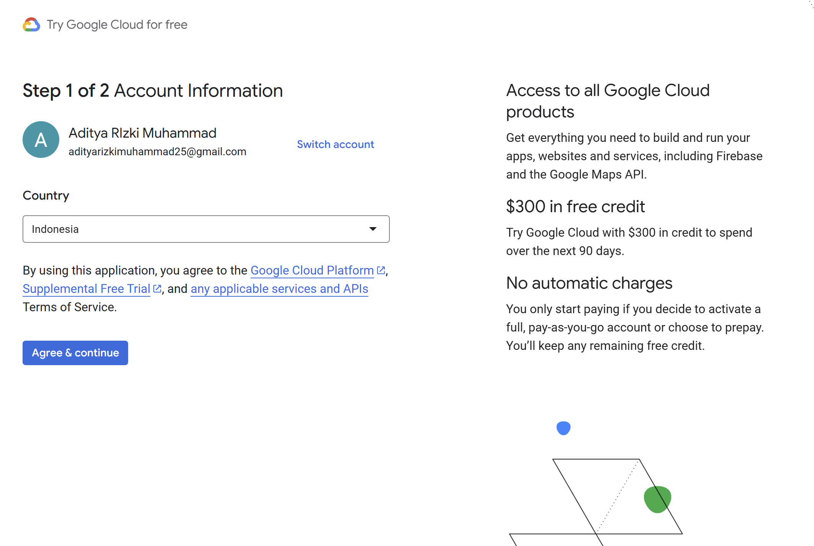

3. Ikuti langkah-langkah aktivasi:

- Verifikasi identitas (biasanya diperlukan kartu kredit, tapi tidak akan dikenakan biaya selama masa gratis).

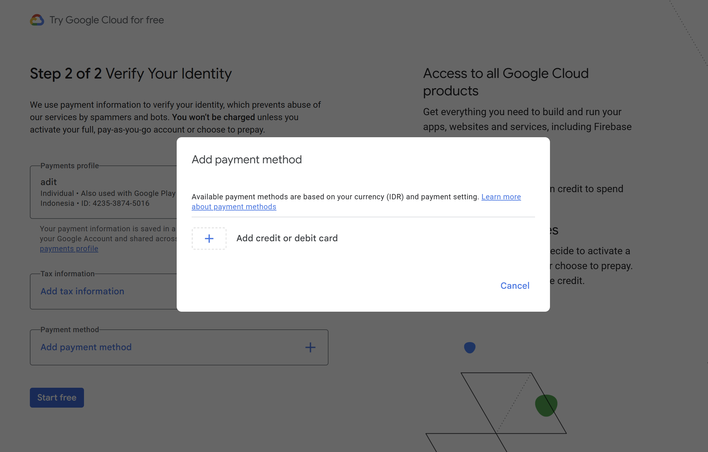

- GCP memberikan **$300 kredit gratis** untuk 90 hari penggunaan.

4. Setelah berhasil, Anda akan diarahkan ke **Google Cloud Console**.

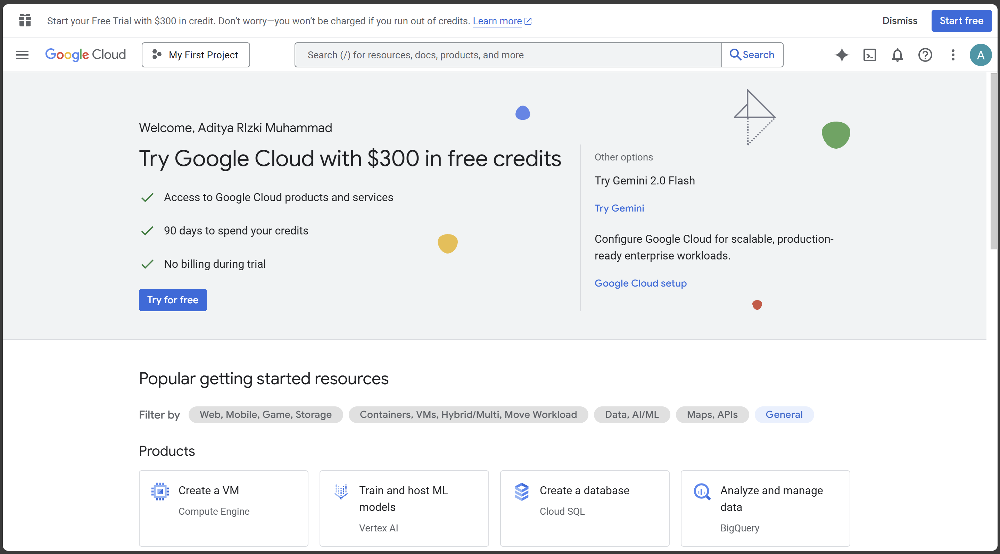

selanjutnya, kita akan membuat vm yang digunakan untuk menjalankan aplikasi kita.

---

### 🏗️ Langkah-langkah Setup VM

1. **Aktifkan Compute Engine**  
   Navigasi ke **Compute Engine > VM instances**. Jika ini pertama kalinya, klik "Enable" untuk mengaktifkan API Compute Engine.

   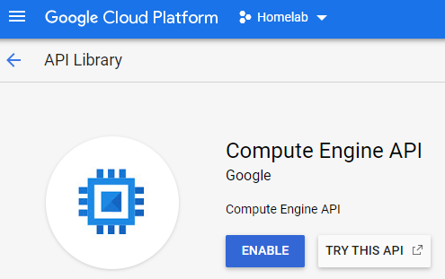

3. **Buat Instance Baru**
- Klik **"Create Instance"**.
- Isi detail instance:
    - **Name**: misalnya `ctfd-vm`
    - **Region** dan **Zone**: pilih `asia-southeast2 (Jakarta)`.
    - **Machine type**: untuk uji coba, gunakan preset `e2-micro`.
- **Firewall**:
    - Centang **Allow HTTP traffic**
    - Centang **Allow HTTPS traffic**

4. **Buat VM**
   Klik **"Create"** dan tunggu hingga instance selesai dibuat.

5. **Atur Static IP**

    Cari layanan *IP Addresses* setelah itu cari ip external anda pada daftar. Tekan promote to static sesuai pada gambar.
    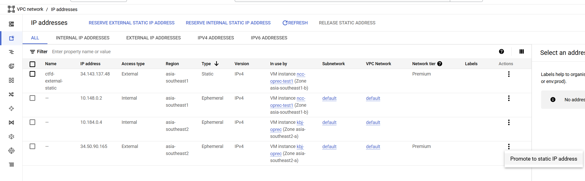


Setelah VM aktif, tekan tombol SSH lalu akan muncul pop-up yang meminta anda untuk mengizinkan SSH pada browser. Tekan `Authorize` untuk melanjutkan setup vm.

- lakukan `sudo su` lalu ketik `nano /etc/ssh/sshd_config`, lalu lakukan perubahan supaya kedua baris PermitRootLogin dan PasswordAuthentication menjadi seperti berikut

        PermitRootLogin yes
        PasswordAuthentication yes

- ketik `systemctl restart sshd`

- ketik `passwd` lalu masukkan password baru untuk root anda

setelah langkah langkah diatas anda seharusnya dapat melakukan koneksi melalui powershell anda.

.gif)

---

### 🐋Install Dependensi

Untuk melakukan hosting CTFD kita perlu mengunduh beberapa dependensi, yaitu :

- Git
- Docker
- Docker Compose

#### Instalasi Docker dan Docker Compoase

**Docker** adalah platform open-source yang memungkinkan Anda untuk membuat, mengirim, dan menjalankan aplikasi dalam container. Container adalah unit standar perangkat lunak yang mengemas kode dan semua dependensinya sehingga aplikasi dapat berjalan dengan konsisten di berbagai lingkungan. Docker membantu mengatasi masalah perbedaan lingkungan pengembangan, pengujian, dan produksi.

untuk menginstall docker, pastikan terlebih dahulu distro vm anda

```
root@kbj-oprec:~# cat /etc/os-release

PRETTY_NAME="Debian GNU/Linux 12 (bookworm)"
NAME="Debian GNU/Linux"
VERSION_ID="12"
VERSION="12 (bookworm)"
VERSION_CODENAME=bookworm
ID=debian
HOME_URL="https://www.debian.org/"
SUPPORT_URL="https://www.debian.org/support"
BUG_REPORT_URL="https://bugs.debian.org/"
```

disitu kita bisa tahu bahwasannya kita menggunakan Debian. Untuk itu, kita akan menginstall docker engine dan docker compose menggunakan tutorial pada dokumentasi docker. [install docker engine debian](https://docs.docker.com/engine/install/debian/)

selanjutnya seperti pada dokumentasi kita diminta menghapus beberpa package menggunakan baris berikut

    for pkg in docker.io docker-doc docker-compose podman-docker containerd runc; do sudo apt-get remove $pkg; done

selanjutnya setup docker's apt repository:

    # Add Docker's official GPG key:
    sudo apt-get update
    sudo apt-get install ca-certificates curl
    sudo install -m 0755 -d /etc/apt/keyrings
    sudo curl -fsSL https://download.docker.com/linux/debian/gpg -o /etc/apt/keyrings/docker.asc
    sudo chmod a+r /etc/apt/keyrings/docker.asc

    # Add the repository to Apt sources:
    echo \
    "deb [arch=$(dpkg --print-architecture) signed-by=/etc/apt/keyrings/docker.asc] https://download.docker.com/linux/debian \
    $(. /etc/os-release && echo "$VERSION_CODENAME") stable" | \
    sudo tee /etc/apt/sources.list.d/docker.list > /dev/null
    sudo apt-get update

selanjutnya install docker versi terbarunya:

    sudo apt-get install docker-ce docker-ce-cli containerd.io docker-buildx-plugin docker-compose-plugin

Terakhir, pastikan docker dan docker compose sudah terinstall.

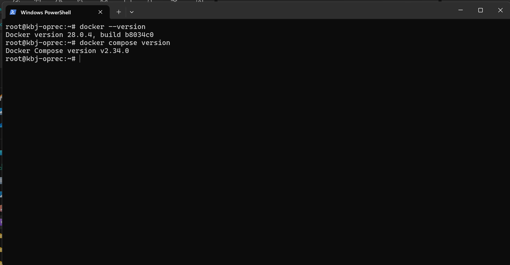

#### Instalasi Git

dengan masih menggunakan user root, jalankan script berikut pada terminal

    apt update
    apt install git

selanjutnya masuk ke halaman [CTFD Docs](https://docs.ctfd.io/docs/deployment/installation). Lalu, lakukan clone pada repository yang disediakan pada dokumentasi. 

jika sudah melakukan clone, anda bisa masuk ke dalam folder CTFd dan lakukan `docker compose up -d`. Nantinya setelah proses build selesai, anda bisa akses ip eksternal anda. Anda seharusnya akan dialihkan ke aplikasi CTFd.

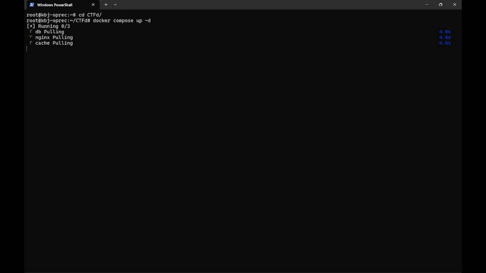

*nb : jika terjadi error 502 bad gateway. Tunggu beberapa menit hingga menampilkan laman ctfd*

selanjutnya, kita akan menambahkan domain pada ip kita

---

### 🗄️Setup Domain

Ada alasan keamanan yang kuat untuk menggunakan domain dibandingkan hanya mengandalkan IP address. Dengan menggunakan domain, Anda dapat dengan mudah mengintegrasikan sertifikat SSL/TLS untuk mengamankan koneksi menggunakan HTTPS. HTTPS mengenkripsi data yang dikirimkan antara pengguna dan server, sehingga melindungi informasi sensitif seperti kredensial login atau data pribadi dari serangan seperti man-in-the-middle.

#### Membeli Domain

Jika beberapa dari kalian belum memiliki domain sebelumnya, kalian bisa masuk ke `https://www.hostinger.com/id/domain-murah` dan membeli domain disana, anda bisa langsung mengetik nama domain yang anda inginkan. Sebagai informasi, kalian bisa membeli domain dimana saja tidak terbatas pada hostinger -- beberapa alternatif lain seperti namecheap, DomainNesia, .dsb bisa dijadikan tempat membeli domain.

fyi : namecheap domain gratis ketika menghubungkannya dengan github student. [name cheap - github student](https://education.github.com/pack/redeem/namecheap-domain-student)

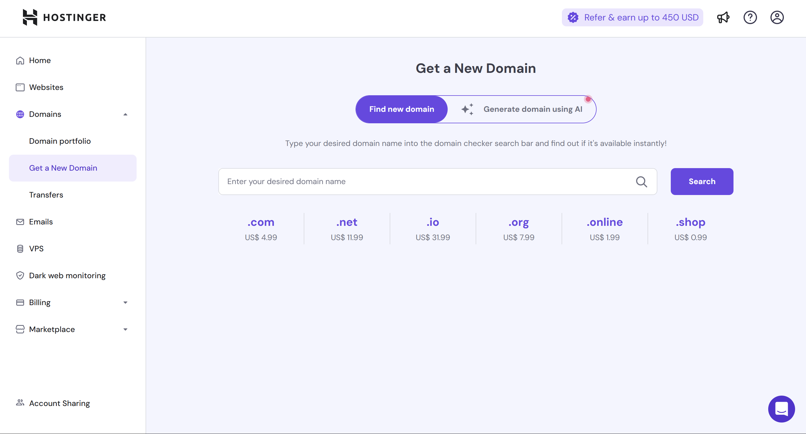


pada kolom pencarian `Enter your desired domain` silahkan tulis nama domain yang anda inginkan. Pilih salah satu domain, kemudian isi data diri anda.

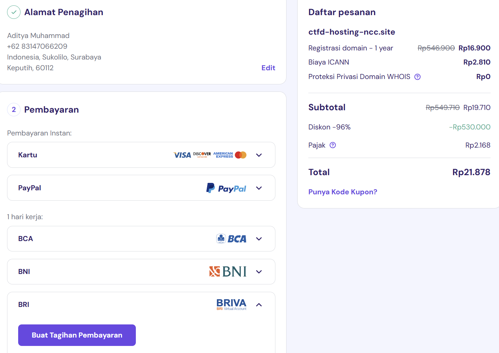

pastikan anda mendaftar domain anda pada **server indonesia** (`hostinger.com/id`) karena hal ini berpengaruh ke metode pembayaran yang tersedia.

nantinya setelah melakukan pembayaran, anda akan diminta mengisi beberapa formulir. Setelah itu anda akan dialihkan ke hpanel dan kalian bisa cek domain kalian pada bagian domain di kiri. 

Anda memerlukan aktifasi domain anda dengan menekan tombol verifikasi yang dikirim melalui email yang anda daftarkan.

Kita tidak akan mengatur DNS record pada hostinger, tetapi kita akan mengaturnya menggunakan fitur pada cloudflare yaitu cloudflare **zerotrust**.

#### Zero Trust


Cloudflare Zero Trust adalah pendekatan keamanan jaringan yang tidak mempercayai siapa pun atau perangkat apa pun secara default—baik dari dalam maupun luar jaringan.

Semua permintaan akses ke aplikasi harus diverifikasi terlebih dahulu, menggunakan identitas pengguna, status perangkat, dan kebijakan keamanan yang telah ditetapkan, sebelum akses diberikan.

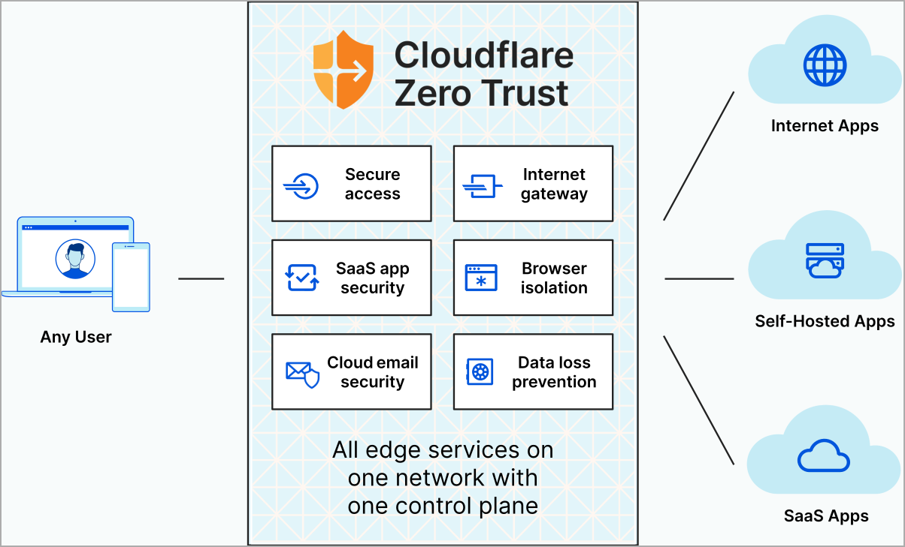

Referensi : [https://neosolutions.ca/cloudflares-zero-trust-suite-is-now-available-for-at-risk-groups-for-free/](https://neosolutions.ca/cloudflares-zero-trust-suite-is-now-available-for-at-risk-groups-for-free/)

untuk mulai menggunakannya, masuk ke dashboard cloudflare (pastikan kalian sudah memiliki akun cloudflare). Lalu tekan pada tombol **+ Add a domain** setelah anda memasukkan nama domain anda, nantinya pilih free plan untuk pengaturan domain anda.

Sekarang, ketika kalian kembali ke dashboard cloudflare anda akan menyadari terdapat peringatan **invalid nameservers**. Hal ini terjadi karena kita belum mengubah namerserver kita menjadi nameserver cloudflare.

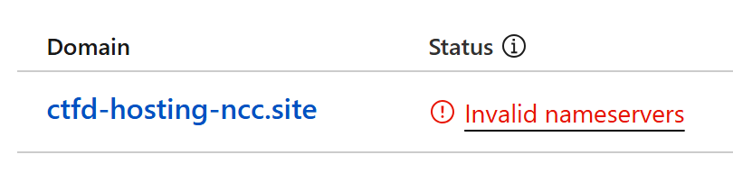

Berikut cara mengubah nameserver pada domain provider anda :

- pada cloudflare, klik pada nama domain yang terdapat peringatan *invalid nameserver*. Lalu, scroll ke bawah hingga anda melihat nameserver dari cloudflare.

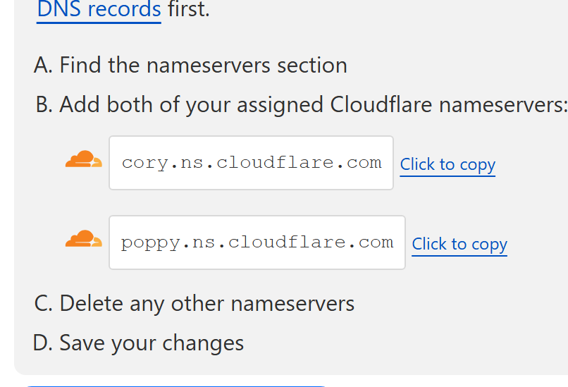

- selanjutnya, ganti nameserver pada registrar anda -- dalam kasus ini adalah Hostinger. kita bisa melihat ini pada menu domain dan pilih nama domain.

- pada menu DNS/Nameserver. tekan tombol ganti nameserver

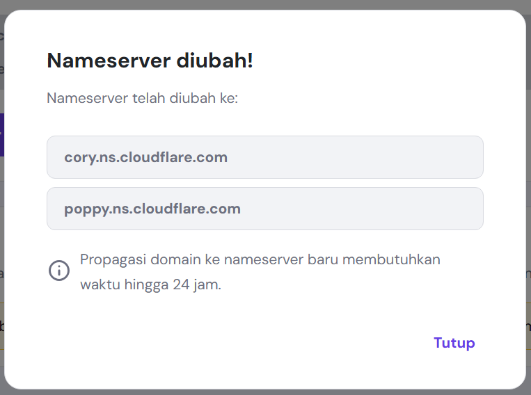

- Proses ini membutuhkan waktu yang bervariatif. Tunggu untuk beberapa waktu.

*nb : pada domain yang saya gunakan untuk materi ini dibutuhkan waktu selama 1 jam hingga aktif*

Setelah proses pemindahan nameserver selesai, selanjutnya kita akan masuk ke menu **Zero Trust** --> **Networks** --> **Tunnels**. Buat sebuah cloudflared tunnel, beri nama yang mendeskripsikan tunnel untuk domain anda.

Selanjutnya pada langkah *Install and run connectors* pilih docker. Nantinya anda akan diminta menjalankan sebuah baris perintah docker pada vm anda

    docker run cloudflare/cloudflared:latest tunnel --no-autoupdate run --token [token]

anda bisa mencoba menjalankan kode tersebut pada vm anda, tetapi ketika menutup commandline yang digunakan untuk menjalankan baris tersebut, maka service akan berhenti. Untuk itu, kita akan ubah menjadi seperti berikut.

    docker run -d --name cloudflared --restart=always cloudflare/cloudflared:latest tunnel --no-autoupdate run --token [token]

Setelah anda menjalankan baris tersebut, nantinya akan ada tulisan terkoneksi yang menandakan docker sudah berjalan dan terkoneksi dengan cloudflare. Setelah itu, anda akan diminta memasukkan informasi mengenai dimana aplikasi berjalan. 

masukkan nama domain anda dan protokol http dengan ip vm anda pada *public hostname*

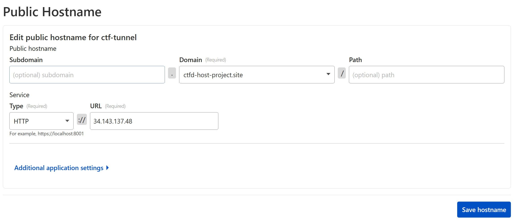

tekan simpan. Kemudian, anda bisa mengakses domain anda melalui chrome. Jika tidak ada kesalahan, seharusnya domain anda sudah memiliki HTTPS 

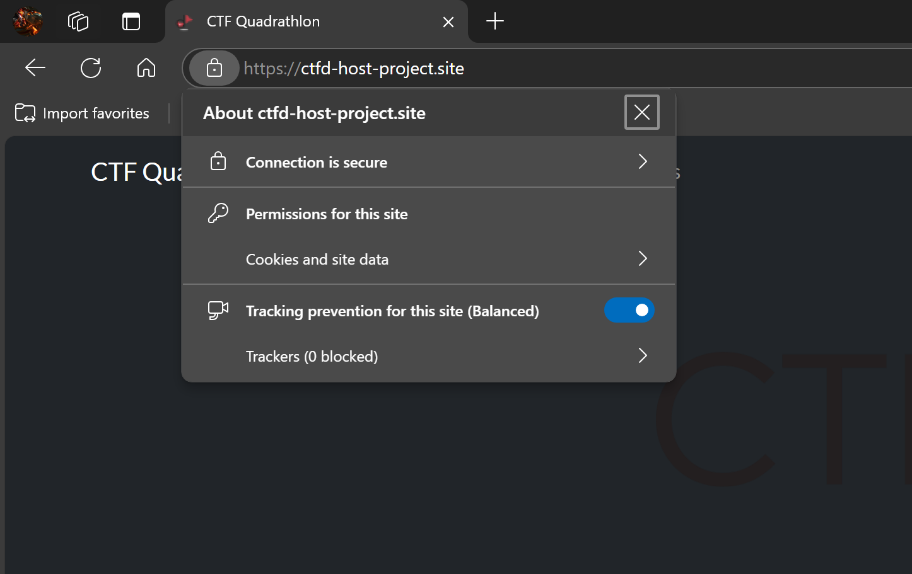

Dengan demikian anda sudah mampu melakukan hosting platform ctf menggunakan CTFD pada VM

---

Opsional : 

- Selesaikan setup akun pada aplikasi CTFD
- Pada kasus nyata, terdapat soal seperti web exploitation pada ctf. Untuk itu, terdapat folder (nanti akan diberikan secara terpisah) yang berisikan aplikasi untuk mengerjakan ctf -- anda diminta untuk mendeploynya juga.